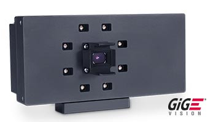
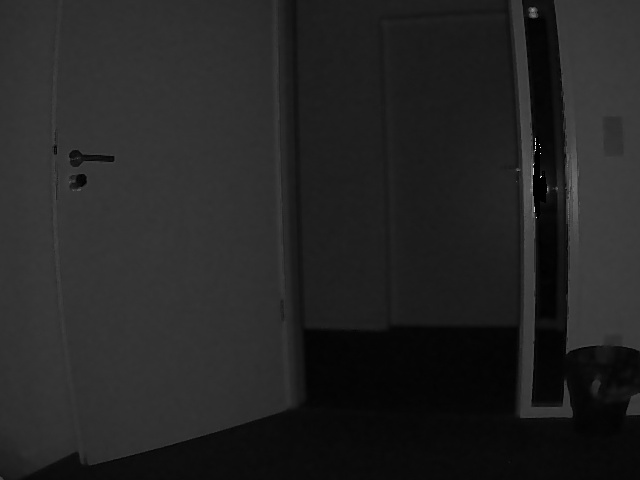
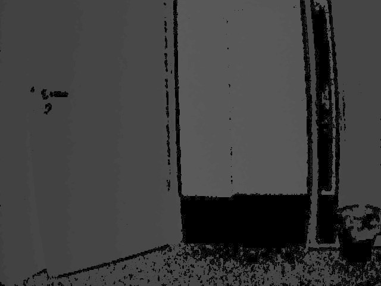
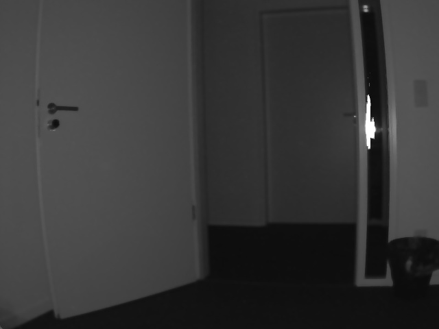
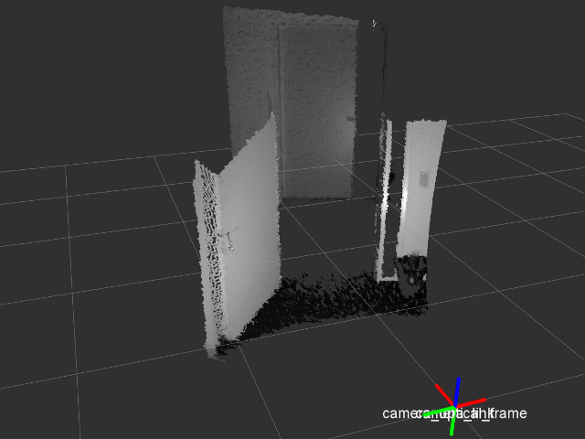
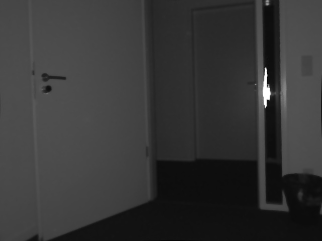

Basler ToF camera ROS driver
============================

This is a ROS driver for the Basler ToF ES (Engineering Sample) 3D camera:




Installation
------------

* Get the file `basler-tof-driver-1.1.0-x86_64.tar.gz` (available from
  [baslerweb.com](http://www.baslerweb.com/de/produkte/kameras/3d-kameras/time-of-flight-kamera/tof640-20gm_850nm#software))
  and unpack it.
* Move the directory `BaslerToF` from that archive to `/opt/BaslerToF`.
* Do **not** put this directory on your `LD_LIBRARY_PATH`; it contains custom
  versions of Qt and other libraries that interfere with the system libraries.
* Clone this repo into your Catkin workspace and install as usual. If unsure,
  refer to the commands in the [.travis.yml](.travis.yml) file.


Running
-------

```bash
roslaunch basler_tof basler_tof.launch
```


ROS API (basler_tof_node)
-------------------------

### Published Topics



`confidence/image_raw` ([sensor_msgs/Image](http://docs.ros.org/api/sensor_msgs/html/msg/Image.html))

* The confidence image (each pixel represents the confidence in the depth
  value). This is the same as the intensity image, but with too
  bright / dark pixels beyond a certain threshold replaced by NaN values.

`confidence/camera_info` ([sensor_msgs/CameraInfo](http://docs.ros.org/api/sensor_msgs/html/msg/CameraInfo.html))

* The corresponding camera info (calibration values).

----------------------------------------------------------------------



`depth/image_raw` ([sensor_msgs/Image](http://docs.ros.org/api/sensor_msgs/html/msg/Image.html))

* The depth image.

`depth/camera_info` ([sensor_msgs/CameraInfo](http://docs.ros.org/api/sensor_msgs/html/msg/CameraInfo.html))

* The corresponding camera info (calibration values).

----------------------------------------------------------------------



`intensity/image_raw` ([sensor_msgs/Image](http://docs.ros.org/api/sensor_msgs/html/msg/Image.html))

* The intensity image.

`intensity/camera_info` ([sensor_msgs/CameraInfo](http://docs.ros.org/api/sensor_msgs/html/msg/CameraInfo.html))

* The corresponding camera info (calibration values).

----------------------------------------------------------------------



`points` ([sensor_msgs/PointCloud2](http://docs.ros.org/api/sensor_msgs/html/msg/PointCloud2.html))

* Point cloud, directly from the device driver. Has intensities, but cannot be user-calibrated.

----------------------------------------------------------------------

`depth/points` ([sensor_msgs/PointCloud2](http://docs.ros.org/api/sensor_msgs/html/msg/PointCloud2.html))

* Point cloud computed from the depth/image_raw and depth/camera_info topic. No
  intensities, but takes into account user calibration. This topic is not
  directly published by the node, but by the `depth_image_proc/point_cloud_xyz`
  nodelet in the launch file.

There are also several rectified topics published via `image_proc` in the
launch file, for example `intensity/image_rect`:



### Parameters

#### Not Dynamically Reconfigurable Parameters

`~frame_id` (`string`, default: "camera_optical_frame")

* The frame id used in the sensor messages.

`~camera_info_url` (`string`, default: None)

* An URL pointing to a camera info yaml in camera_info_manager format.

#### Dynamically Reconfigurable Parameters

See the [dynamic_reconfigure](/dynamic_reconfigure) package for details on
dynamically reconfigurable parameters.

`~frame_rate` (`int`, default: 15)

* Acquisition rate at which the frames are captured. [Hz] Range: 1 to 15

`~exposure_auto` (`bool`, default: True)

* Enable automatic exposure mode.

`~exposure_time` (`int`, default: 15000)

* Exposure time when `exposure_auto = false`. Range: 300 to 30000

`~exposure_agility` (`double`, default: 0.4)

* Reaction speed of the continuous exposure mechanism when `exposure_auto = true`.
  Range: 0.1 to 1.0

`~exposure_delay` (`int`, default: 2)

* The number of frames it takes until the continuous exposure mechanism reacts
  to a change in the exposure time when `exposure_auto = true`. Range: 1 to 10

`~confidence_threshold` (`int`, default: 2048)

* Pixels have to exceed the confidence value specified here in order to be
  taken into account for the distance measurement Range: 0 to 65536

`~spatial_filter` (`bool`, default: True)

* Enable the spatial noise filter (uses the values of neighboring pixels to
  filter out noise in an image).

`~temporal_filter` (`bool`, default: True)

* Enable the temporal noise filter (uses the values of the same pixel
  at different points in time to filter out noise in an image).

`~temporal_strength` (`int`, default: 190)

* Strength of the temporal filter. The higher the value, the further back the
  memory of the filter reaches. High values can cause motion artifacts, while
  low values reduce the efficacy of the filter. Range: 50 to 240

`~outlier_tolerance` (`int`, default: 2000)

* Maximum distance that a pixel's depth is allowed to differ from that of its
  neighboring pixels [mm]. Range: 0 to 65535


Calibration
-----------

Due to a bug in `camera_calibration`
([ros-perception/image_pipeline#246](https://github.com/ros-perception/image_pipeline/issues/246)),
cameracalibrator.py does not work well with `mono16` image encodings. To work
around this, uncomment the following two lines in `src/basler_tof_node.cpp` and
re-run `catkin_make`:

```c++
  // intensity_cvimg.image.convertTo(intensity_cvimg.image, CV_8U, 1.0 / 256.0);
  // intensity_cvimg.encoding = sensor_msgs::image_encodings::MONO8;
```

After this, run calibration as usual:

```bash
rosrun camera_calibration cameracalibrator.py image:=/camera/intensity/image_raw camera:=/camera/intensity --size 6x7 --square 0.05
```

Troubleshooting
---------------

**Q:** I get the following error:

    Failed to load the producer file ProducerTOF.cti: ProducerTOF.cti: cannot open shared object file: No such file or directory

**A:** This means that the file `ProducerTOF.cti` (from BaslerToF) is not on
the LD_LIBRARY_PATH. Make sure that you have installed the basler-tof-driver to
`/opt/BaslerToF` or adjust the `basler_tof_path` argument of `basler_tof.launch`
accordingly.


Open Issues
-----------

According to the Basler documentation, the point cloud's origin is at the front
of the camera housing:

> The reference location used is Anchor. This is the default value. The
> reference point is fixed to the origin of the camera's coordinate system,
> i.e. x and y are 0 at the central pixel of the sensor and z is 0 at the front
> of the camera housing.

However, the camera_optical_frame is defined by the camera's lens, which could
result in an offset in the *z* direction of several millimeters.


Build Status
------------

### Build Job Status (Travis)

| | Indigo | Jade | Kinetic |
| --- | --- | --- | --- |
| basler_tof | [](https://travis-ci.org/uos/basler_tof) | [](https://travis-ci.org/uos/basler_tof) | N/A |

*Note:* There is a Kinetic branch, but Travis doesn't provide Xenial hosts that are required for building on Kinetic.

### Doc Job Status (ROS build farm)

| | Indigo | Jade | Kinetic |
| --- | --- | --- | --- |
| doc | [](http://build.ros.org/job/Idoc__basler_tof__ubuntu_trusty_amd64/) | [](http://build.ros.org/job/Jdoc__basler_tof__ubuntu_trusty_amd64/) | [](http://build.ros.org/job/Kdoc__basler_tof__ubuntu_xenial_amd64/) |
